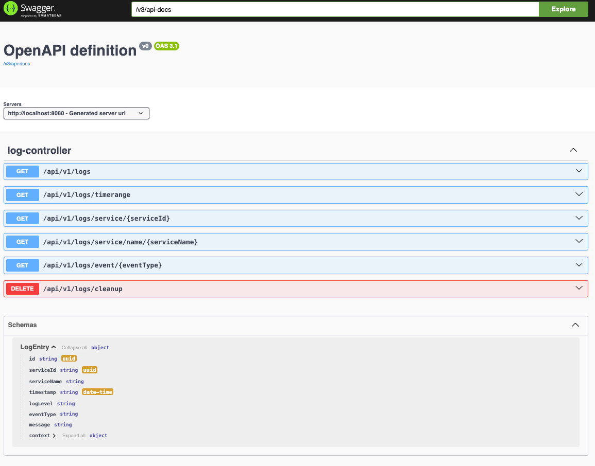

# Distributed Logging System

A distributed logging system built with Spring Boot, Apache Kafka, and Apache Cassandra to demonstrate event-driven architecture and distributed data storage.

## Technical Design Document
https://docs.google.com/document/d/1Tcnpw5KfwOSbAcDdFDorTyGVP4CtNkDM9nA1oLl98cE/edit?usp=sharing

## Overview

This project implements a centralized logging system that captures, processes, and stores logs from multiple services. It uses Apache Kafka for reliable message queuing and Apache Cassandra for scalable log storage.

### Key Features

- Real-time log ingestion using Apache Kafka
- Scalable log storage using Apache Cassandra
- RESTful APIs for log retrieval and management
- Support for different log levels and event types
- Contextual logging with additional metadata
- Scheduled log generation for testing

## Technologies

- Java 21
- Spring Boot 3.4.2
- Apache Kafka
- Apache Cassandra
- Project Lombok
- Spring Security
- Docker & Docker Compose

## Dependencies
- Spring Boot Starter Web
- Spring Boot Starter Data Cassandra
- Lombok
- Spring-Kafka
- SpringDoc OpenAPI
- JUnit 5 & Mockito

## Prerequisites

- JDK 21
- Docker and Docker Compose
- Maven

## Getting Started

1. Clone the repository

2. Build containers using Docker Compose; cassandra, kafka, and zookeeper services will be started
```bash
docker-compose up -d


# when you are done, you can stop the services
docker-compose down
``` 

3. (If necessary) Create a keyspace and table in Cassandra
```bash
docker exec -it <CID> cqlsh

## Create a keyspace
CREATE KEYSPACE logging_keyspace WITH replication = {'class': 'SimpleStrategy', 'replication_factor': 1};

## Create a table
CREATE TABLE IF NOT EXISTS logging_keyspace.logs ( 
    service_id uuid, 
    service_name text,
    timestamp timestamp, 
    id uuid, 
    log_level text, 
    event_type text, 
    message text, 
    context map<text, text>, 
    PRIMARY KEY (id, timestamp)
) WITH CLUSTERING ORDER BY (timestamp DESC);


## Create indexes
CREATE INDEX IF NOT EXISTS idx_logs_service_name ON logging_keyspace.logs (service_name);

CREATE INDEX IF NOT EXISTS idx_logs_event_type ON logging_keyspace.logs (event_type);

CREATE INDEX IF NOT EXISTS idx_logs_service_id ON logging_keyspace.logs (service_id);

CREATE INDEX IF NOT EXISTS idx_logs_timestamp ON logging_keyspace.logs (timestamp);
```sql


4. Run the application
```bash
./mvnw clean install spring-boot:run

```

5. Access the Swagger UI at http://localhost:8080/swagger-ui/index.html

6. It will generate a log every 30 seconds. You can check the logs in the Cassandra table.
```bash
===============Produced log: LogEntry(id=a41b00d4-f6c8-4586-8814-02b487a63a82, serviceId=416a6d71-f315-49e9-be07-63040b40c228, serviceName=sample-service, timestamp=2025-01-30T21:55:38.796778, logLevel=INFO, eventType=SYSTEM_TRIGGER, message=Sample log message, context={})==================
```
6. RESTful APIs

